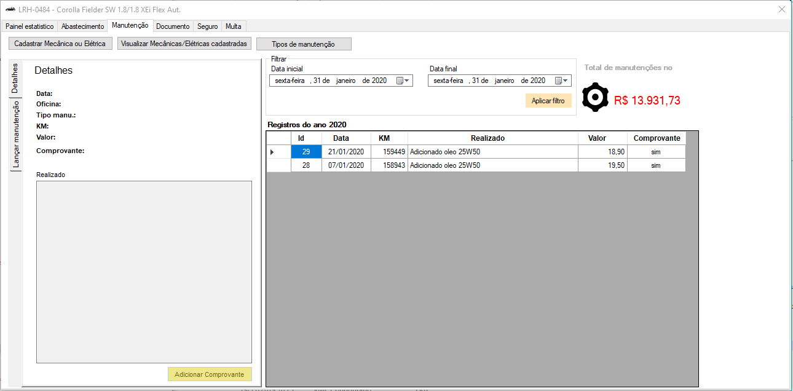

# Gestão de Frotas

O objetivo deste projeto é gerenciar os gastos com seu veículo ou frota de veículos.

| :placard: Vitrine.Dev |     |
| -------------  | --- |
| :sparkles: Nome        | **Gestão de Frota**
| :label: Tecnologias | c#
| :rocket: URL         | https://github.com/ezequielsd/GestaoFrotaVitrine
| :fire: Site     | https://ezequieldaniel.wordpress.com/

<!-- Inserir imagem com a #vitrinedev ao final do link -->

Elaborado por Ezequiel da Silva Daniel

[Blog](https://ezequieldaniel.wordpress.com/)  
[Email](ezequielsd@gmail.com)

  

## Apresentação

Sistema para gerenciar os gasto com seu veiculo ou frota. Gerencie gastos como combustivel, oleo, multas, CNH e manutenções.
Inicialmente comecei a desenvolver para suprir uma necessidade própria, que era ter uma melhor gestão dos gasto do meu veículo, mas na medida que foi sendo adicionado funcionalidades percebi que poderia ser utilizado por outras pessoas.

## Requisitos

Para executar o programa é necessário:
* Ter Windows instalado, qualquer versão.
* Ter o Framework .Net 4.5.2 instalado.

## Instalação

Não há necessidade de instalação, basta executar o **GestaoFrota.exe**.
Para realizar debug e compilar, deve clonar o repositório ou baixar o código fonte em .zip.

## Como utilizar

**Para usuários**

Basta baixar o programa no tópico **Release** mais abaixo, descompactar em alguma pasta e rodar o GestaoFrota.exe. Ele é estilo portable, ou seja, não é necessário sua instalação, sendo assim, é aconselhado a colocar a pasta em um pen driver ou hd externo e levar para qualquer lugar. Ao executar ele pela primeira vez, um arquivo chamado **Frota.sdf** será criado, ele é o banco de dados onde conterá todas as informações, e será gerado dentro da própria localização do executável. O sistema suporta uma boa capacidade de dados, porém para frotas acima de 5 carros entre em contato comigo que é mais aconselhado a usar um banco na nuvem, ou se for para empresa, será melhor instalar um banco SQL Server Express. Mas nestá situação, entre em contato que passo as orientações.
Na pasta do programa, será criado tres novas pastas:

* Comprovantes - esta pasta será usada para o programa salvar os comprovantes de abastecimentos, troca de oleo, anexadas no momento do lançamento do gasto.
* Documentos - esta pasta será usada para salvar os documentos do carro, CNH anexadas no programa.
* Multas - esta pasta será usada para salvar as multas anexadas.
* Seguro - esta pasta será usada para salvar os contratos de seguro anexados.

**Para desenvolvedores**

O código do projeto é liberado com o intuido a fomentar o opensource para tecnologia .NET, fica livre para ser clonado para aprender ou até sugerir melhorias e alterações no projeto. Algumas informações importantes:

* A solução foi desenvolvida no Framework 4.5.2, em Windows Forms.
* É utilizado o banco de dados SQl Server Compact, tornando a aplicação portable.
* É utilizado o Entity Framework 6 Code First, porém o migration não funciona com este banco, apenas cria do zero, não aplica a alteração do modelo, logo se precisar alterar um campo no banco, deve conectar o VS e aplicar o script de alteração.

Na pasta do programa, será criado tres novas pastas:

* Comprovantes - esta pasta será usada para o programa salvar os comprovantes de abastecimentos, troca de oleo, anexadas no momento do lançamento do gasto.
* Documentos - esta pasta será usada para salvar os documentos do carro, CNH anexadas no programa.
* Multas - esta pasta será usada para salvar as multas anexadas.
* Seguro - esta pasta será usada para salvar os contratos de seguro anexados.

**Importante**

É de extrema importancia que o usuário mantenha o backup da pasta do programa periódicamente salvo em outro local, para garantir a integridade dos dados, se por algum motivo o disco aonde o programa esteja localizado seja corrompido.
O ideal é pegar toda a pasta da aplicação e compactar e salvar em Google driver ou OneDrive, ou qualquer outro serviço.
Estou pensando em desenvolver um serviço para realizar este backup em algum serviço a ser indicado pelo usuário, mas até lá, a melhor maneira é seguir por este caminho.
Sempre preencha o maior numero de informações possíveis, principalmente no momento de lançamento de algum gasto (Abastecimento, óleo, manutenção), se possível anexe o comprovante, para que na janela de estatística ele apresente informações reais e também seja possível consultas futuras.

Baixem e usem, duvidas, reclamações, problemas ou sugestões, podem me informar através do próprio programa, na tela principal em "Sugestões ou duvidas", como pode ver na imagem acima, que eu responderei com maior prazer. Ajude-me a enriquecer estre programa.

## Imagens do programa

**Dica:**
Quando absteço eu ao entrar no carro já anoto a quilometragem no comprovante, ai pego o comprovante e passo o maximo de informação disponivel:

## Pacotes de terceiro

N.A.

## Autor

Ezequiel da Silva Daniel  

## Licença

[MIT]

## Release

A versão Release do programa, executável com suas dependencias, basta copiar para um pen driver ou hd externo e levar para qualquer lugar, pode ser baixado no link abaixo:

Atenção, aqui é para aqueles que apenas querem utilizar o programa...

[Gestão de Frota](Release/Release.zip)

