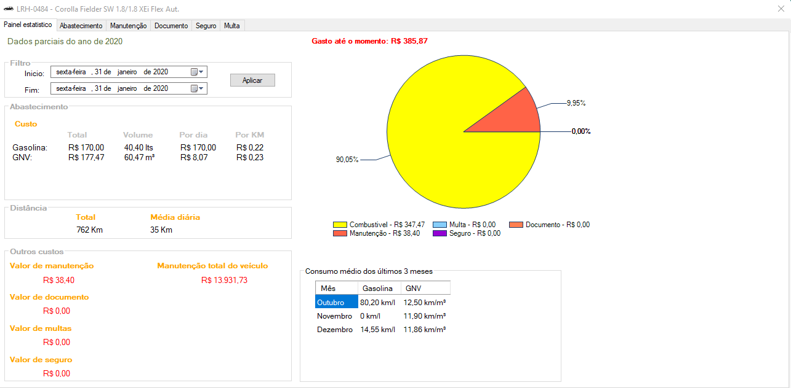

# Nome do meu projeto

O objetivo deste projeto é gerenciar os gastos com seu veículo ou frota de veículos.

| :placard: Vitrine.Dev |     |
| -------------  | --- |
| :sparkles: Nome        | **Gestão de Frota**
| :label: Tecnologias | c#
| :rocket: URL         | https://github.com/ezequielsd/GestaoFrotaVitrine
| :fire: Desafio     | https://url-do-desafio.com.br

<!-- Inserir imagem com a #vitrinedev ao final do link -->

Elaborado por Ezequiel da Silva Daniel

  

## Detalhes do projeto

Textos e imagens que descrevam seu projeto, suas conquistas, seus desafios, próximos passos, etc...
